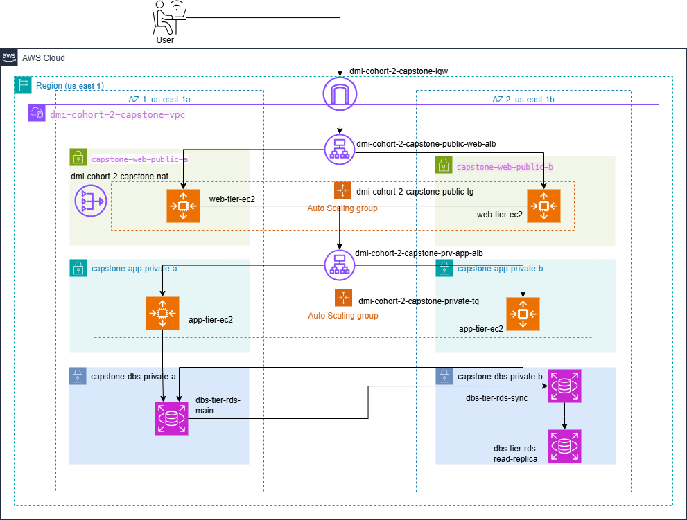

# Assignment-4

**What You'll Build**

You will deploy a three-tier web application (Next.js + Node.js + MySQL) using AWS:
- Presentation Layer (Web Tier): Next.js frontend running on Ubuntu, behind Nginx and a public ALB
- Business Layer (App Tier): Node.js/Express backend served on port 3010, behind an internal ALB
- Data Layer (Database Tier): MySQL RDS in private subnets, with Multi-AZ and a read replica


**Assignment Goals**

- Practice deploying a full-stack application across networking, compute, and database layers
- Understand isolation between application tiers and secure network architecture
- Use real-world tools (ChatGPT, AWS Docs, forums) to find answers, debug, and design
- Gain confidence in running and troubleshooting cloud-based applications independently

**Technical Requirements**
1. VPC and Subnet Setup
- Create a custom VPC using 10.0.0.0/16
- Define 6 subnets across 2 Availability Zones:
    - 2 for the Web Tier (public)
    - 2 for the App Tier (private)
    - 2 for the Database Tier (private)
Note: IP Calculation sheets

2. Security Groups and Load Balancers
- Create security groups:
    - Web Tier: Allow HTTP (80) and ALB-to-EC2 traffic
    - App Tier: Allow only Web Tier SG traffic on port 3001
    - DB Tier: Allow only App Tier SG traffic on port 3306

- Setup two ALBs:
    - A public ALB for the frontend
    - An internal ALB for the app servers

3. EC2 and Application Deployment
- Web Tier (Next.js):
    - Run on port 80 behind Nginx
    - Serve from an EC2 instance in the public subnet

- App Tier (Node.js backend):
    - Run on port 3001, in private subnets
    - Should not be publicly accessible
Note: Avoid Elastic IPs in final architecture

4. MySQL RDS Setup
- Use Amazon RDS for MySQL
- Configure Multi-AZ and Read Replica
- Place DB instances in private subnets
- Secure using SG rules and test DB connectivity from App Tier

**Book Review App Deployment on AWS - 3 Tier Architecture**

- Deploy a real-world 3-tier web application
- Implement secure AWS networking
- Follow Production best practices



**Application Overview**
- Frontend: Next.js
- Backend: Node.js/Express
- Database: MySQL

## Network Setup (VPC, Subnet, Routing)

**Step 1: Create the VPC**

1. Go to **VPC Console** > **Your VPCs** > **Create VPC**.
2. Select **VPC only**. Name: *dmi-cohort-2-capstone-vpc* | CIDR: *10.0.0.0/16*. Click **Create VPC**.
3. Select *dmi-cohort-2-capstone-vpc*, click **Actions** > **Edit VPC settings**, check **Enable DNS hostnames**, and save.

**Step 2: Create the 6 Subnets**

1. Go to **Subnets** > **Create subnet** > Select *dmi-cohort-2-capstone-vpc*.
2. Add 6 subnets across two AZs (*us-east-1a* and *us-east-1b*)

    - *dmi-cohort-2-capstone-web-public-a*  | AZ:a | CIDR: *10.0.0.0/24*
    - *dmi-cohort-2-capstone-web-public-b*  | AZ:b | CIDR: *10.0.1.0/24*
    - *dmi-cohort-2-capstone-app-private-a* | AZ:a | CIDR: *10.0.10.0/24*
    - *dmi-cohort-2-capstone-app-private-b* | AZ:b | CIDR: *10.0.11.0/24*
    - *dmi-cohort-2-capstone-dbs-private-a* | AZ:a | CIDR: *10.0.20.0/24*
    - *dmi-cohort-2-capstone-dbs-private-b* | AZ:b | CIDR: *10.0.21.0/24*

**Step 3: Create the Internet and NAT Gateway**

1. Go to **VPC** > **Internet Gateway** > Create internet gateway *dmi-cohort-2-capstone-igw*
2. Click on **Attach to a VPV** or Go to **Actions** > **Attach to VPC** > Select VPC *dmi-cohort-2-capstone-vpc*.
3. Go to **VPC** > **NAT Gateway** > Create NAT gateway *dmi-cohort-2-capstone-nat*
4. Select **Zonal** under **Availability mode**
5. For **Subnet** select the *dmi-cohort-2-capstone-web-public-a* and **Connectivity type** should be *Private*.
6. Click on **Allocate Elastic IP** under **Elastic IP allocation ID**.

**Step 4: Route Tables**

1. For **Public Route**: Create *dmi-cohort-2-capstone-public-rt* in your VPC *dmi-cohort-2-capstone-vpc*.
    - 0.0.0.0/0 target the **Internet gateway** *dmi-cohort-2-capstone-igw*
    - For Subnet associations, check **ONLY** *dmi-cohort-2-capstone-web-public-a* and *dmi-cohort-2-capstone-web-public-b*

2. For **Private Route**: Create *dmi-cohort-2-capstone-private-rt* in your VPC *dmi-cohort-2-capstone-vpc*.
    - 0.0.0.0/0 target the **NAT gateway** *dmi-cohort-2-capstone-nat*
    - For Subnet associations, check **all the private subnets**;
        - *dmi-cohort-2-capstone-app-private-a*
        - *dmi-cohort-2-capstone-app-private-b*
        - *dmi-cohort-2-capstone-dbs-private-a*
        - *dmi-cohort-2-capstone-dbs-private-b*

## Security Group

**Step 1: Create all 5 Security Groups**

1. GO to **VPC** > **Security Groups** Click on **Create security group**

    - *dmi-cohort-2-capstone-public-alb-sg*: Allow HTTP (80) from 0.0.0.0/0
    - *dmi-cohort-2-capstone-web-ec2-sg*: Allow HTTP (80) from *dmi-cohort-2-capstone-public-alb-sg*, Allow SSH (22) from My IP.
    - *dmi-cohort-2-capstone-internal-alb-sg*: Allow HTTP (80) from *dmi-cohort-2-capstone-web-ec2-sg*
    - *dmi-cohort-2-capstone-app-ec2-sg*: Allow Custom TCP (3001) from *dmi-cohort-2-capstone-internal-alb-sg*, Allow SSH (22) from *dmi-cohort-2-capstone-web-ec2-sg*
    - *dmi-cohort-2-capstone-dbs-sg*: Allow MySQL (3306) from *dmi-cohort-2-capstone-app-ec2-sg*

## Database Tier

**Step 1: Create the Subnet Group**

1. Go to **RDS Console** > **Subnet groups** > Create *dmi-cohort-2-capstone-dbs-subnet-group*
2. Select VPC *dmi-cohort-2-capstone-vpc*. Add the two database private subnets *dmi-cohort-2-capstone-dbs-private-a* and *dmi-cohort-2-capstone-dbs-private-b*

**Step 2: Primary Multi-AZ Database**

1. Create Database > **Standard Create** > **MySQL** > **Dev/Test**
2. Instance Identifier:*dmi-cohort-2-capstone-db* | Credentials: *admin*/*Password123* BenefitWallet$2026, Instance Configuration: *Burstable classes (includes t classes)*, Additional storage configuration: Additional storage configuration
3. Select the database instnaceL *db.t3.micro*
4. Multi-AZ: Create a standby instance (Synchronous Standby)
5. Connectivity: VPC: *dmi-cohort-2-capstone-vpc*, RDS Subnet: *dmi-cohort-2-capstone-dbs-subnet-group*, Public access: **NO**, VPC > Security Group: *dmi-cohort-2-capstone-dbs-sg*
6. Additional monitoring settings: [] Enable Enhanced monitoring (remove check)
6. Addition Database config: Initial Database Name: *bookreview*. Backup retention: 1 day, Click on *Create*

**Step 3: Read Replica**

1. Select database Identifier:*dmi-cohort-2-capstone-db* **Actions** > **Create read replica**.
2. Identifier: *dmi-cohort-2-capstone-db-replica*. Multi-AZ: **No**. Click *Create*

## Load Balancer, High Availability Tier

**Step 1: Target Group, Internal Application Load Balancer**

1. Go to **EC2** > **Target Group** > Click on **Create target groups** Settings
    - Target type: Instances
    - Targt group name: *dmi-cht-2-capstone-internal-tg*
    - Port: HTTP targetting Custom Port 3001 for the *dmi-cohort-2-capstone-internal-alb-sg*
    - VPC: *dmi-cohort-2-capstone-vpc*
    - Click on **Next**. Register targets **Next**. Click on **Create target group**

2. Go to **EC2** > **Load Balancing** > **Load Balancer** Click on **Create load balancer** *dmi-cohort-2-capstone-alb*
    - Scheme: Internal
    - Load balancer IP addresses type: IPv4
    - Network mapping: VPC, Availability Zones and subnets: *us-east-1a (use1-az4)* [*dmi-cohort-2-capstone-app-private-a*] and *us-east-1b (use1-az6)* [dmi-cohort-2-capstone-app-private-b]
    - Security Groups: *dmi-cohort-2-capstone-internal-alb-sg*
    - Click on *Create load balancer*

**Step 2: Target Group, Public Application Load Balancer**

1. Go to **EC2** > **Target Group** > Click on **Create target groups** Settings
    - Target type: Instances
    - Targt group name: *dmi-cht-2-capstone-public-tg*
    - Port: HTTP targetting Port 80
    - VPC: *dmi-cohort-2-capstone-vpc*
    - Click on **Next**. Register targets **Next**. Click on **Create target group**

2. Go to **EC2** > **Load Balancing** > **Load Balancer** Click on **Create load balancer** *dmi-cohort-2-capstone-pub-alb*
    - Scheme: Internet-facing
    - Load balancer IP addresses type: IPv4
    - Network mapping: VPC, Availability Zones and subnets: *us-east-1a (use1-az4)* [*dmi-cohort-2-capstone-web-public-a*] and *us-east-1b (use1-az6)* [dmi-cohort-2-capstone-web-public-b]
    - Security Groups: *dmi-cohort-2-capstone-public-alb-sg*
    - Click on *Create load balancer*


## Configuring EC2 Instances

**Step 1: Create Master Instance**

**Web**

1. Go to **EC2** > **Instances** > **Launch an instance** *dmi-cohort-2-capstone-web-ec2-master*
2. Select **Ubuntu 24.04 LTS**, Instance Type: *t2.micro*
    - Keypair: *dmi-cohort2-keypair*
3. Click on **Edit** under Network settings
    - VPC: *dmi-cohort-2-capstone-vpc*
    - Subnet: *dmi-cohort-2-capstone-web-public-a*
    - Auto-assign public IP: *Enable*
    - Firewall (Security group): *dmi-cohort-2-capstone-web-ec2-sg*
4. Click on **Launch instance**

**App**

1. Go to **EC2** > **Instances** > **Launch an instance** *dmi-cohort-2-capstone-app-ec2-master*
2. Select **Ubuntu 24.04 LTS**, Instance Type: *t2.micro*
    - Keypair: *dmi-cohort2-keypair*
3. Click on **Edit** under Network settings
    - VPC: *dmi-cohort-2-capstone-vpc*
    - Subnet: *dmi-cohort-2-capstone-app-private-a*
    - Auto-assign public IP: *Disable*
    - Firewall (Security group): *dmi-cohort-2-capstone-app-ec2-sg*
4. Click on **Launch instance**

**Step 2: Setting up Master App (Backend)**

1. From the Git terminal, navigate the location of the keypair file. Run the command below:
    `scp -i dmi-cohort2-keypair.pem dmi-cohort2-keypair.pem ubuntu@98.92.225.136:/home/ubuntu/`
2. SSH into the Web, change key permissions, and connect to App:
    `ssh -i dmi-cohort2-keypair.pem ubuntu@98.92.225.136`
3. Change keypair file permissions:
    `chmod 400 dmi-cohort2-keypair.pem`
4. Connect to **App Private EC2** from the **Web Master EC2**
    `ssh -i "dmi-cohort2-keypair.pem" ubuntu@10.0.10.22`
5. Run the following commands in **App Private EC2**
    `sudo apt update && sudo apt install nodejs npm mysql-client -y`
    `sudo npm install -g pm2`
    `git clone https://github.com/pravinmishraaws/book-review-app.git`
    `cd book-review-app/backend`
    `npm install`
    `nano .env` in the private app server
1. Set *.env* and update with the script below:

```bash
DB_HOST=dmi-cohort-2-capstone-db.co16s6q6g4t2.us-east-1.rds.amazonaws.com
DB_NAME=bookreview
DB_USER=admin
DB_PASS='xxxxxxxxxxxxxxxxx12345'
DB_DIALECT=mysql
ALLOWED_ORIGINS=http://dmi-cohort-2-capstone-pub-alb-1698196715.us-east-1.elb.amazonaws.com
PORT=3001

```
2. Run the command:

```bash
node src/server.js
```
3. Run the *pm2* process manager tool

```bash
pm2 start src/server.js --name "backend"
pm2 save
pm2 startup

[PM2] Init System found: systemd
[PM2] To setup the Startup Script, copy/paste the following command:
sudo env PATH=$PATH:/usr/bin /usr/local/lib/node_modules/pm2/bin/pm2 startup systemd -u ubuntu --hp /home/ubuntu
Exit
pm2 status
```
4. Eixt the **private app EC2 instance**. This takes you back to the **public web EC2 instance**.

**Step 3: Configure Master Web (Frontend)**

1. Install and configure

```bash
sudo apt update && sudo apt install nodejs npm nginx -y

sudo npm install -g pm2

git clone https://github.com/pravinmishraaws/book-review-app.git

cd book-review-app/frontend

npm install

nano .env
NEXT_PUBLIC_API_URL=/api

```
2. Build the frontend

```bash
npm run build

pm2 start npm --name "frontend" -- run start

pm2 save

pm2 startup

[PM2] Init System found: systemd
[PM2] To setup the Startup Script, copy/paste the following command:
sudo env PATH=$PATH:/usr/bin /usr/local/lib/node_modules/pm2/bin/pm2 startup systemd -u ubuntu --hp /home/ubuntu

pm2 status

```

2. Configure the Nginx Reverse Proxy:

```bash
sudo nano /etc/nginx/sites-available/default

# Past the code block

server {
    listen 80;
    server_name_;
    location / {
        proxy_pass http://localhost:3000;
        proxy_http_version 1.1;
        proxy_set_header Upgrade $http_upgrade;
        proxy_set_header Connection 'upgrade';
        proxy_set_header Host $host;
        proxy_cache_bypass $http_upgrade;
    }
    location /api/ {
        rewrite ^/api/(.*) /$1 break;
        proxy_http_version 1.1;
        proxy_pass http://internal-dmi-cohort-2-capstone-alb-1083657486.us-east-1.elb.amazonaws.com;
        proxy_set_header Host $host;
    }

}

```
3. Restart Nginx

```bash
sudo nginx -t
sudo systemctl restart nginx
```

## Create AMI via Launch Templates

**Step 1: Create the AMIs**

1. Go to **EC2 Instance**. Select *dmi-cohort-2-capstone-app-ec2-prv-master*. Click **Actions** > **Image and templates** > **Create image**. Name: *dmi-cohort-2-capstone-app-ami*
2. Select *dmi-cohort-2-capstone-web-ec2-pub-master*. Click **Create image**. Name: *dmi-cohort-2-capstone-web-ami*
3. Wait for both **AMIs** to be Available. Check on the **AMI** on the left panel.

**Step 2: App Tier Auto Scaling (Backend)**

1. Go to **Launch Template**. Create *dmi-cohort-2-capstone-app-lt*. Select *dmi-cohort-2-capstone-app-ami*, t2.micro, keypair, SG: *dmi-cohort-2-capstone-app-ec2-sg*. No subnets
2. Go to **Auto Scaling Group**: Create *dmi-cohort-2-capstone-app-asg*. Template: *dmi-cohort-2-capstone-app-lt*
Overite existing setting
3. Select VPC: *dmi-cohort-2-capstone-vpc*, AZ & Subnet: *dmi-cohort-2-capstone-app-private-a* and *dmi-cohort-2-capstone-app-private-b*
4. Under "Integration with other services", choose **Attached to an existing LB** and select *dmi-cht-2-capstone-internal-tg*, Health checks: *Turn on ELB Health checks*, Configure group size and scaling: *Desired capacity* 2, *Min* 2, *Max* 4

**Step 3: Web Tier Auto Scaling (Frontend)**

1. Go to **Launch Template**: Create *dmi-cohort-2-capstone-web-lt*. Select *dmi-cohort-2-capstone-web-ami*, t2.micro, keypair, SG: *dmi-cohort-2-capstone-web-ec2-sg*. 
**CRITICAL**: Under Advanced Network configuration, click *Add network interface* and set *Auto-assign public ip to Enable*
2. Go to **Auto Scaling Group**: Create *dmi-cohort-2-capstone-web-asg*. Template: *dmi-cohort-2-capstone-web-lt* 
3. Select VPC: *dmi-cohort-2-capstone-vpc*, AZ & Subnet: *dmi-cohort-2-capstone-web-public-a* and *dmi-cohort-2-capstone-web-public-b*. Load Balancer: Attach to *dmi-cht-2-capstone-public-tg*. Check *Turn on ELB health checks*. Configure group size and scaling: *Desired capacity* 2, *Min* 2, *Max* 4
4. Final Testing: Confirm that Health checks are ok under **Target group** and Copy the DNS URL of *dmi-cohort-2-capstone-pub-alb* to the browser.

## 🧪 Testing & Validation

**Step 1: Modify the Primary Database**

- Go to the RDS Console > Databases.
- Select your Primary DB and click Modify.
- Scroll down to the Connectivity or Additional Configuration section (depending on your console version) until you find Backup.
- Change Backup retention period from 0 days to 1 day (or more).
- Scroll to the bottom, click Continue, and select Apply immediately.
- Note: This will trigger a brief "Modifying" state and might cause a tiny performance blip as AWS prepares the backup environment.

**Step 2: Wait for the Snapshot**

- Once the modification is complete, AWS needs to take an initial snapshot to act as the "seed" for the replica.
- Wait until the status of your Primary DB returns to Available.
- Once it is available, the "Create read replica" option in the Actions menu will no longer be grayed out.

**Step 3: Proceed with Creation**

- Now you can follow the steps from the previous message:
- Actions > Create read replica.
- Name it (e.g., dmi-cohort-2-capstone-db-replica).
- Ensure it is in the same VPC and Private Subnets as the primary.

### 1. Database Read Replica Verification

To prove the Read Replica is functional and isolated as read-only, perform the following test from a **Private App Tier** instance.

* **Step A: Connect to the Primary DB**

```bash
mysql -h dmi-cohort-2-capstone-db.co16s6q6g4t2.us-east-1.rds.amazonaws.com -u admin -p

# Run a test write
USE bookreview;
INSERT INTO Reviews (userId, bookId, comment, rating, username, createdAt, updatedAt) 
VALUES (1, 1, 'Write to Primary Success!', 5, 'Derek Owusu Bekoe', NOW(), NOW());

INSERT INTO Reviews (userId, bookId, comment, rating, username, createdAt, updatedAt) 
VALUES (4, 3, 'Very Educational', 5, 'John Doe', NOW(), NOW());

```

* **Step B: Connect to the Read Replica**

```bash
mysql -h dmi-cohort-2-capstone-db-replica.co16s6q6g4t2.us-east-1.rds.amazonaws.com -u admin -p

-- Check for the specific test record using the correct column 'comment'
SELECT * FROM Reviews WHERE comment = 'Very Educational';

-- This SHOULD trigger an error because you are on a Read-Only instance
INSERT INTO Reviews (userId, bookId, comment, rating, username, createdAt, updatedAt) 
VALUES (4, 3, 'This write should fail', 1, 'Test User', NOW(), NOW());

```

* **The Proof:** You should receive `ERROR 1290 (HY000): The MySQL server is running with the --read-only option`. This confirms the replica is properly synced but restricted to read-heavy traffic.
